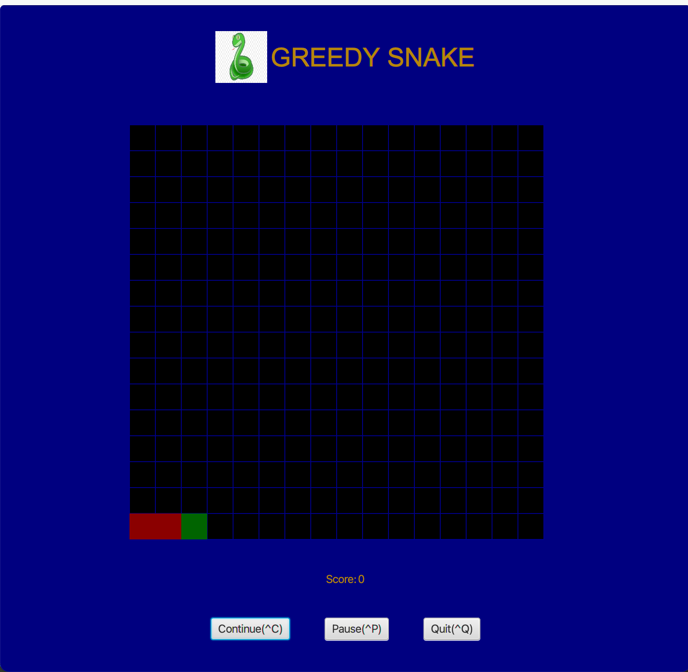
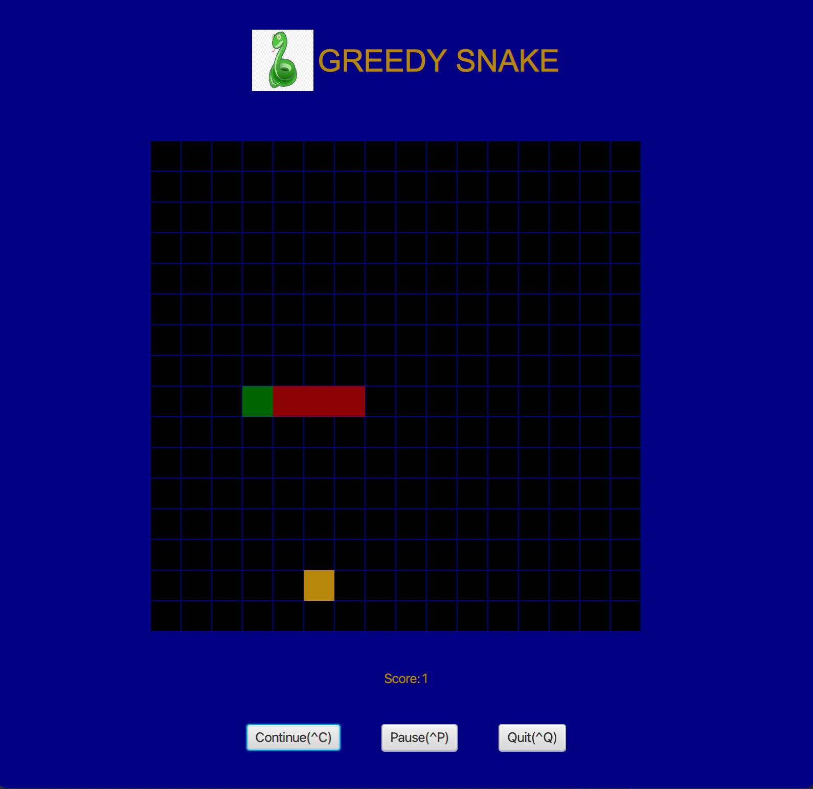
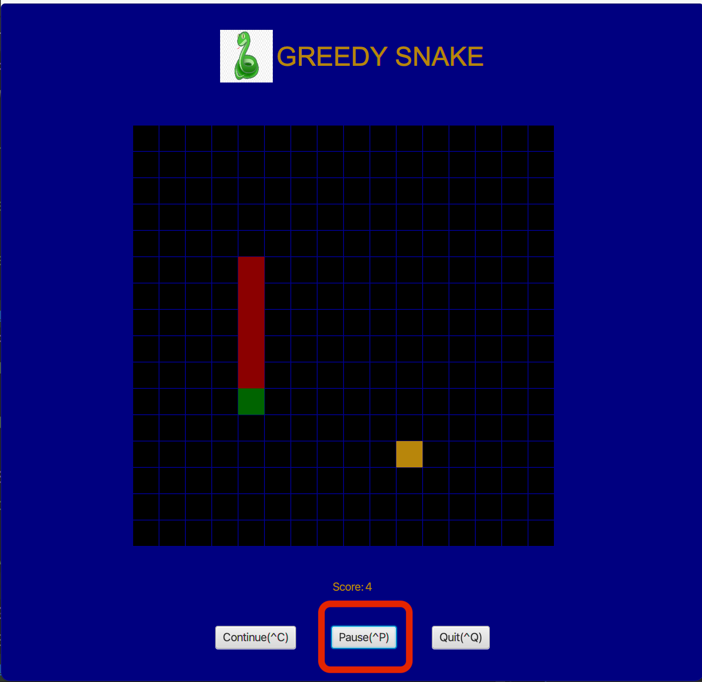
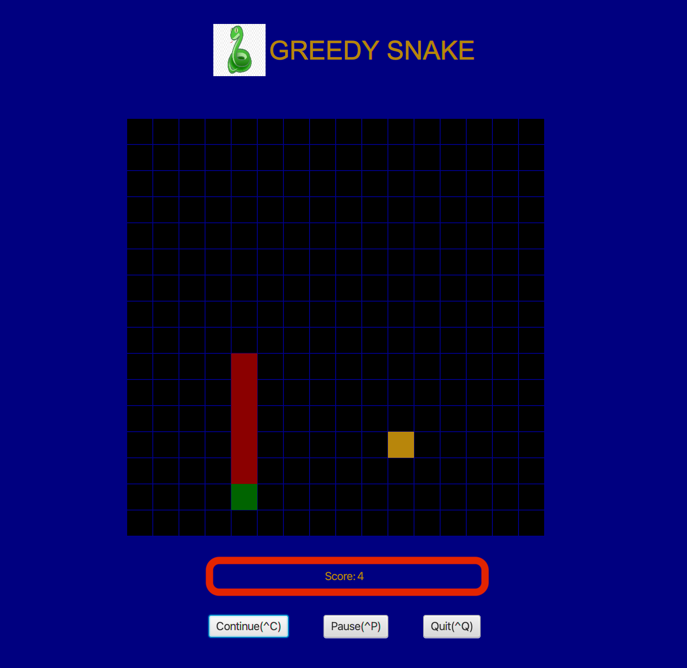
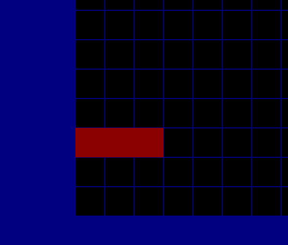
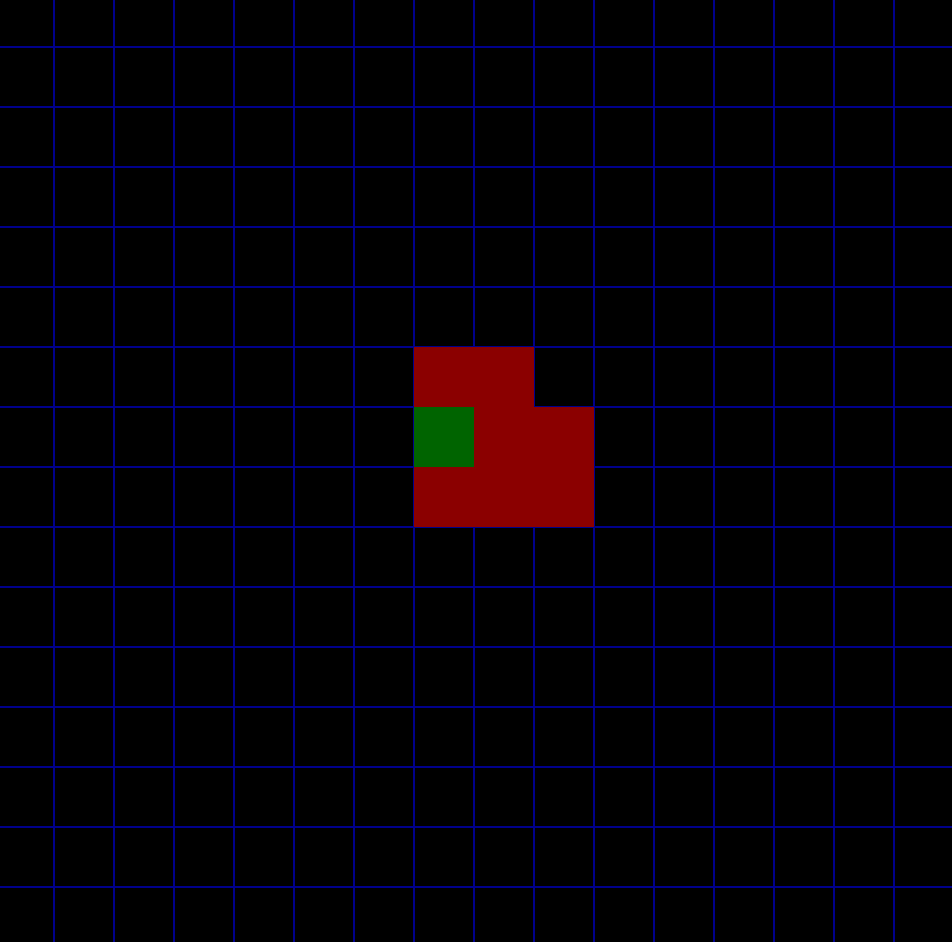

# Greedy Snake

## Starting
> `ENTER` to start game
>

## Running
> `W` `A` `S` `D` to move
> 
> Green: snake head
> 
> Red: snake body
> 
> Yellow: Food
> 

## Pausing
> Click `Pause` button to pause the game.
> 
> Click `Continue` button to resume.
>

## Score
> You can see your score at the bottom.
> 
> Every food ate by the snake worth one point.
>

## Game over
> `ENTER` to restart game
> 
> Game is over if snake eats itself or hits the wall.
>

## Quiting
> Click `Quit` button to quit the game.